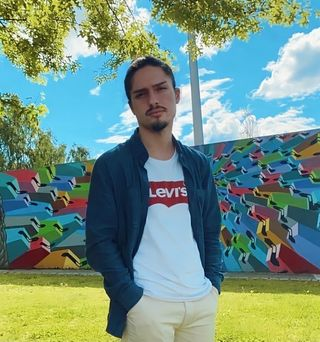

<h1 align="center">Hi! I'm Gonçalo</h1>

  

<h3 align="center">Software engineering student @ University of Minho</h3>

<h3 align="left">Connect with me:</h3>

<h3 align="left">Languages and Tools:</h3>

<h3 align="center">📘 Languages 📙</h3>

    

<h2 align="center">⚒️ Tools ⚒️</h2>

    

  

  
&nbsp;

